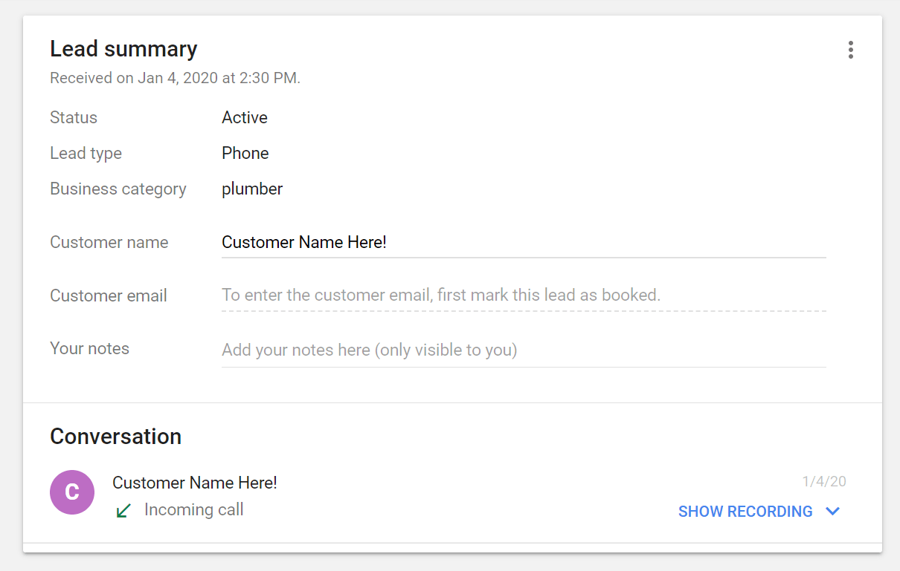

# Why Your Google Local Service Ads Aren't Spending

There are two main reasons your phones aren't ringing from Google Guarantee Ads. See these and more tips!

The most common reason your Google Local Service Ads aren't spending are because:

- You don't answer your phone
- You don't close deals, or at least you don't tell Google that you're closing deals.

Got it? Well let's talk more about why this happens, and go over other tips that can make an impact on upping your spend for Google Guarantee Ads.

## Why Google Prioritizes Some Companies Over Others

If you're trying [Google Guarantee Ads (AKA Local Service Ads)](https://ads.google.com/local-services-ads/), chances are you have tried Home Advisor leads or Google Ads. One thing that will stand out to you when comparing Google Guarantee Ads is that it's so much cheaper.

Where roofers may be spending over $250 for a call in competitive areas, the cost per call might only be $35 through Google Guarantee Ads. The price is often even better than through Home Advisor, and you're not forced to compete with other companies just to talk to your lead.

Because the cost per lead through Google Guarantee is so much leader, why doesn't everyone shift their budget there?

Well, people have. In some areas and some services, like yours if you found this article, there are just too many people who want Google Guarantee leads, versus the supply.

Now traditionally, like with Google Ads or Home Advisor, the bidding war starts and prices go up to the highest bidder. But much like how you wouldn't want to refer a friend to a bad company that just pays you the most, Google is making a long term bet that they'll make the most amount of money if they give customers to the best companies.

Google does everything in their power to send customers to the best companies.

## What Does That Even Mean?

Google can't know who the best company is, but they work with what they have. And in the case of the Google Guarantee program, the two most import things are your response rate and booking rate.

To put it simply: Google wants people to have their phone calls answered, and ideally, they want customers to call as few businesses as possible.

How many calls do you answer? If that number is less than 75% of all calls, you've got a problem. Really, that number should be as close to 100% as possible.

To check, go to your "Leads" report to this view:

Click on any customer, and see if you picked up, or not.

Chances are, you're not hitting the numbers you need to in order for Google to prioritize you.

While it would be nice to see your response rate in a nice and easy format, I haven't found an easy way to do that besides just going through each lead. However, as you may know, it's easier to find the Booking Rate in your Reports section.

## Answer Your Phone, And...

How does Google know if you answered your phone and had a conversation with a lead? You've got to tell them! For every single call that comes in *you must* enter the customer name into the Lead Summary section.

Adding notes, their email, and marking the lead as booked are also an absolute must (if you close them of course).

If you don't have the mobile app, here are the download links. [Apple](https://apps.apple.com/us/app/local-services-ads-by-google/id1069142544). [Android](https://play.google.com/store/apps/details?id=com.google.android.apps.ads.homeservices&hl=en_US).

## What To Do If You Already Answer Every Call

We're leaving the world of *musts*, and entering a world of *shoulds.* While what I'm about to tell you isn't a concrete strategy that is guaranteed to work, there's no BS peddling.

The two big things that you should aim to beat your competitors on are reviews and photos.

### A Concrete Way To Get Better Reviews

Getting reviews sucks. It seems like no matter how often you try to ask your customers for a review they've got an excuse. You know the ones.

Short of giving discounts (which some companies end up doing despite the risks), the least you can do is make it easier for your customers to review you, and that's what I'll show you here (PS. This is a main function that Podium charges [hundreds a month](https://try.podium.com/custom-pricing/) for that you can do for free and in 5 minutes).

End Result: A clickable link that takes you right to the Google Review location. [http://bit.ly/review-compass-restoration](https://bit.ly/review-compass-restoration)

Step One: Go to [Whitespark.ca](https://whitespark.ca/google-review-link-generator/) to get a Google Review Link.

Step Two: Go to bit.ly, create an account, and make a custom link like so:

Step 3: Text the link to your customers!

### You Probably Need More Photos

Take a look at this:

You're familiar with this view. Look at how much of an emphasis Google is giving to photos! So do yourself a favor. Look at your competitor's listings and ensure you have more photos than them. Just add one a week until they're doubled

A Super Important Note: Why should I choose the company from above? They've given me no reasons, and the photo doesn't help. If you had a picture of you and a happy customer, now that's a winning strategy.

Think of it this way: how many products do you look at on Amazon before buying? If you're like most people, it's at least a handful. Prospects are the same way. The majority of people who land on your screen *will not* click to call you. By having a nice image with a happy customer, you're giving yourself a fighting chance. to convert the lead.

## Everything You Learned About Getting More Google Guarantee Leads

1.  Answer your phones
2.  If you answer the phone, add the name to the Google Guarantee dashboard
3.  Get reviews. Use the above method to send shortlinks that make it more convenient
4.  Get photos. Good photos, and more photos than your competitor

That's all! Now go close some leads!
